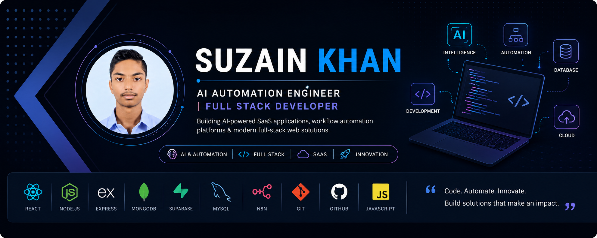

  

# Hi 👋 I'm Suzain Khan

### AI Automation Engineer • Full Stack Developer

Building AI-powered SaaS applications, workflow automation platforms, and modern full-stack software solutions.

---

# 💼 About Me

- 🎓 Bachelor of Computer Applications (BCA)
- 🤖 AI Automation Engineer & Full Stack Developer
- 🚀 Building AI-powered SaaS applications and workflow automation platforms
- ⚡ Experienced in React.js, Node.js, Express.js, MongoDB, Supabase, REST APIs, OAuth, and n8n
- 🎯 Passionate about solving real-world business problems through software engineering and automation

---

# 🛠 Tech Stack

### Languages

### Frontend

### Backend

### Database

### Tools & Platforms

---

# 🚀 Featured Projects

## 🤖 Jomocal AI
One-click AI Automation Platform helping businesses automate workflows using AI, OAuth, APIs, and n8n.

🔗 https://github.com/Suzainkhan-SK/Jomocal-AI

---

## 🧠 ToolMate AI
AI-powered productivity platform featuring 67+ AI tools for developers, creators, students, and businesses.

🔗 https://github.com/Suzainkhan-SK/codemate-ai-toolkit

---

## 🎁 Premium Access Zone
Gamified rewards platform with authentication, referrals, Telegram verification, and payment integration.

🔗 https://github.com/Suzainkhan-SK/PAZ-PremiumAccessZone-Original-https-premiumaccesszone.netlify.app-

---

## 🛠 OneClick Tools
Collection of modern productivity and utility tools built with React.js.

🔗 https://github.com/Suzainkhan-SK/OneClick-Tools-Render-Deploy

---

## 📸 Face Recognition Attendance System
Face recognition-based attendance management system using PHP and MySQL.

🔗 https://github.com/Suzainkhan-SK/Face-Recognition-Attendance-System

---

# 🏆 Achievements

🥉 3rd Place — NeuroNex 24-Hour Web Development Hackathon

🔐 Cisco Junior Cybersecurity Analyst

🛡 Cyber Security Internship — RankBook Solutions Pvt. Ltd.

---

# 📫 Let's Connect

- 💼 LinkedIn: https://linkedin.com/in/suzainkhan-sk
- 📧 Email: suzainkhan8360@gmail.com

---

> *"I enjoy building software that combines AI, automation, and modern web technologies to solve practical business problems."*
